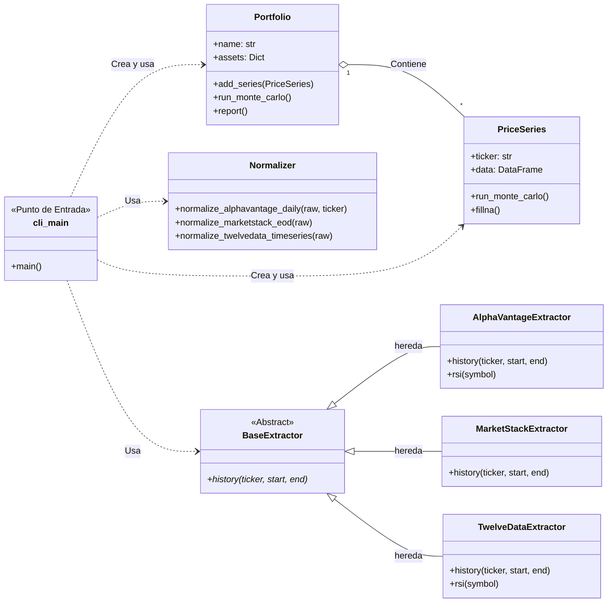

```mermaid
classDiagram
    direction LR

    class BaseExtractor {
        <<Abstract>>
        +history(ticker, start, end)*
    }
    class AlphaVantageExtractor {
        +history(ticker, start, end)
        +rsi(symbol)
    }
    class MarketStackExtractor {
        +history(ticker, start, end)
    }
    class TwelveDataExtractor {
        +history(ticker, start, end)
        +rsi(symbol)
    }

    BaseExtractor <|-- AlphaVantageExtractor : hereda
    BaseExtractor <|-- MarketStackExtractor : hereda
    BaseExtractor <|-- TwelveDataExtractor : hereda

    class Normalizer {
         +normalize_alphavantage_daily(raw, ticker)
         +normalize_marketstack_eod(raw)
         +normalize_twelvedata_timeseries(raw)
    }

    class PriceSeries {
        +ticker: str
        +data: DataFrame
        +run_monte_carlo()
        +fillna()
    }

    class Portfolio {
        +name: str
        +assets: Dict
        +add_series(PriceSeries)
        +run_monte_carlo()
        +report()
    }

    Portfolio "1" o-- "*" PriceSeries : Contiene

    class cli_main {
        <<Punto de Entrada>>
        +main()
    }

    cli_main ..> Portfolio : Crea y usa
    cli_main ..> PriceSeries : Crea y usa
    cli_main ..> Normalizer : Usa
    cli_main ..> BaseExtractor : Usa
```